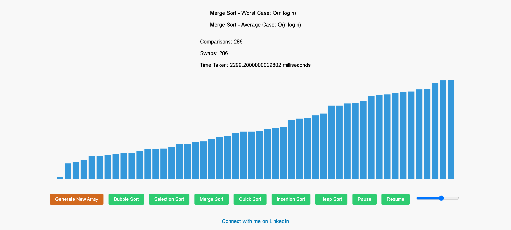

# Sorting Visualizer

A web application for visualizing sorting algorithms. This project is built using Flask for the backend and plain HTML, CSS, and JavaScript for the frontend.

## Features

- Visualize different sorting algorithms: Bubble Sort, Selection Sort, Merge Sort, Quick Sort, Insertion Sort, and Heap Sort.
- Adjust the speed of the visualization.
- Pause and resume the sorting process.
- View performance metrics: number of comparisons, swaps, and time taken.
- Connect with the creator on LinkedIn :).

## Screenshot



## Project Structure
```
sorting_visualizer/
├── static/
│ ├── css/
│ │ └── sortingv.css
│ ├── js/
│ │ └── sortingv.js
├── templates/
│ └── index.html
├── assets/
│ └── screenshot.png
├── app.py
└── requirements.txt
```

## Getting Started

### Prerequisites

- Python 3.x
- Flask

### Installation

1. Clone the repository:

   ```bash
   git clone https://github.com/Ahmad-danaf/sorting-visualizer.git
   cd sorting_visualizer
   ```

2. Create a virtual environment and activate it:

   ```bash
   python3 -m venv venv
   source venv/bin/activate  # On Windows use `venv\Scripts\activate`
   ```

3. Install the required packages:

   ```bash
   pip install -r requirements.txt
   ```

4. Run the application:

   ```bash
   python app.py
   ```

5. Open your web browser and navigate to `http://127.0.0.1:5000`.

## Author

Ahmad Danaf - [Connect with me on LinkedIn](https://www.linkedin.com/in/ahmad-danaf-b37261215/)

## License

This project is licensed under the MIT License.

